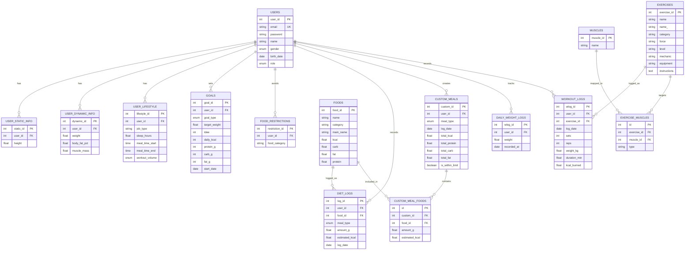

# PhysiQ 💪

> 사용자의 신체 정보 · 생활 습관 · 목표를 기반으로 식단 · 운동 · 체성분 관리를 지원하는 통합 체형 관리 플랫폼

PhysiQ는 사용자의 신장, 체중, 체지방률, 근육량, 활동량, 식사 가능 시간, 목표 체중 등의 정보를 바탕으로 개인별 목표 칼로리와 탄단지 매크로를 계산하고, 이에 맞는 식단·운동 추천과 기록·분석 기능을 제공하는 웹 서비스입니다.

기존 피트니스 서비스가 식단 기록, 운동 기록, 체중 기록 중 일부 기능에만 집중하는 경우가 많다는 점에서 출발하여, PhysiQ는 사용자가 자신의 목표에 맞게 식단과 운동을 **함께** 관리하고 진행 상황을 시각적으로 확인할 수 있도록 하는 것을 목표로 합니다.

---

## 팀 소개 · DB Masters

| 역할 | 이름 | 담당 |
|------|------|------|
| Backend | 이진영 | Express REST API 서버, 인증/비즈니스 로직 |
| Frontend | 배인표 | React UI, 페이지 라우팅, API 연동 |
| Database | 김하람 | ERD 설계, 스키마 정의, 데이터 수집/전처리 |
| 인증/시각화·디자인 | 벌러르쳉군 | JWT 인증, 차트 시각화, Figma UI/UX |

---

## 기술 스택

| 구분 | 기술 |
|------|------|
| Frontend | React, Vite, React Router, TailwindCSS, Recharts |
| Backend | Node.js, Express, JWT, bcrypt, dotenv, CORS |
| Database | MySQL 8.0, Sequelize ORM, mysql2 |

---

## 주요 기능

**회원 / 인증**
- 회원가입, 로그인, JWT 토큰 발급 및 보호 라우트

**온보딩 (사용자 정보 입력)**
- 정적 신체 정보: 키
- 동적 신체 정보: 체중, 체지방률, 근육량
- 생활 습관: 직업 유형, 수면 시간, 식사 가능 시간, 운동량
- 목표: `diet` / `cutting` / `bulk` / `lean_mass` / `recomp` / `dirty_bulk`
- 기피 음식 카테고리

**목표 칼로리 및 탄단지 계산**
- 신체 정보와 활동량 기반 TDEE 계산
- 목표 유형에 따른 일일 권장 칼로리 및 탄·단·지 산출

**식단 관리**
- 목표 기반 끼니별 식단 추천 (아침/점심/저녁/간식)
- 음식 검색 및 추천 식단 / 커스텀 식단 기록
- 날짜별 식단 기록 조회, 총 섭취 칼로리·탄단지 합산
- 기피 음식 카테고리 반영

**운동 관리**
- 목표·운동량 기반 운동 추천 (근력 / 유산소 비율 자동 조정)
- 운동 검색 (카테고리, 난이도 필터)
- 세트·반복·중량·시간·소모 칼로리 기록 및 날짜별 조회

**체중 및 인바디 기록**
- 일일 공복 체중 기록 (같은 날짜 업데이트)
- 최근 30일 체중 기록 조회
- 체중·체지방률·근육량 인바디 정보 저장

**분석 / 진행 상황**
- 최근 30일 체중 변화 분석 (시작/현재/변화량/목표 달성률)
- 일일 영양소 목표 대비 실제 섭취량 (칼로리·단백질·탄수화물·지방 달성률)

---

## 프로젝트 구조

```
PhysiQ/
├── app.js                    # Express 진입점
├── config/database.js        # Sequelize DB 연결
├── controllers/              # API 비즈니스 로직
├── middleware/auth.js        # JWT 인증 미들웨어
├── models/                   # Sequelize 모델 정의
├── routes/                   # Express 라우터
├── physiq_data.sql           # 초기 음식/운동 데이터
└── src/                      # React 프론트엔드
    ├── pages/
    ├── components/
    ├── context/
    └── services/             # API 호출 계층
```

---

## 실행 방법

### 1. 저장소 클론
```bash
git clone https://github.com/oyoing5968/PhysiQ.git
cd PhysiQ
```

### 2. 의존성 설치
```bash
npm install
```

### 3. MySQL 데이터베이스 생성
```sql
CREATE DATABASE physiq
CHARACTER SET utf8mb4
COLLATE utf8mb4_unicode_ci;
```

### 4. 환경 변수 설정 (`.env`)
```env
PORT=3000
DB_HOST=localhost
DB_NAME=physiq
DB_USER=root
DB_PASSWORD=your_mysql_password
JWT_SECRET=your_jwt_secret_key
```

### 5. 백엔드 서버 실행
```bash
npm run server
```
- 서버: `http://localhost:3000`
- API: `http://localhost:3000/api`

### 6. 초기 데이터 삽입
서버를 한 번 실행해 Sequelize 모델 기반 테이블이 생성된 뒤, 음식/운동 데이터를 삽입합니다.
```bash
mysql -u root -p physiq < physiq_data.sql
```

### 7. 프론트엔드 실행
새 터미널에서:
```bash
npm run dev
```
- 클라이언트: `http://localhost:5173`

### 실행 스크립트 요약
| 명령어 | 설명 |
|--------|------|
| `npm run dev` | Vite 프론트엔드 개발 서버 |
| `npm run server` | nodemon 기반 Express 서버 |
| `npm start` | Express 서버 (프로덕션) |
| `npm run build` | 프론트엔드 빌드 |
| `npm run lint` | ESLint 검사 |

---

## DB 설정

백엔드는 Sequelize를 사용해 MySQL에 연결합니다.

```js
const sequelize = new Sequelize(
  process.env.DB_NAME,
  process.env.DB_USER,
  process.env.DB_PASSWORD,
  {
    host: process.env.DB_HOST,
    dialect: 'mysql',
    logging: false,
  }
)
```

| 변수명 | 설명 | 예시 |
|--------|------|------|
| `PORT` | Express 포트 | `3000` |
| `DB_HOST` | MySQL 호스트 | `localhost` |
| `DB_NAME` | DB 이름 | `physiq` |
| `DB_USER` | MySQL 계정 | `root` |
| `DB_PASSWORD` | MySQL 비밀번호 | `password` |
| `JWT_SECRET` | JWT 서명 키 | `physiq_secret_key` |

---

## 주요 API 목록

대부분의 API는 JWT 인증이 필요합니다. 로그인 후 발급받은 토큰을 헤더에 포함하세요.
```http
Authorization: Bearer <JWT_TOKEN>
```

### Auth `/api/auth`
| Method | Endpoint | 설명 | 인증 |
|--------|----------|------|------|
| POST | `/register` | 회원가입 | ✗ |
| POST | `/login` | 로그인 및 JWT 발급 | ✗ |
| POST | `/refresh` | JWT 재발급 | ✗ |

### User `/api/user`
| Method | Endpoint | 설명 | 인증 |
|--------|----------|------|------|
| POST | `/static` | 정적 신체 정보(키) 저장 | ✓ |
| POST | `/dynamic` | 동적 신체 정보(체중·체지방·근육량) 저장 | ✓ |
| POST | `/lifestyle` | 생활 습관 저장 | ✓ |
| GET | `/info` | 사용자 정보 조회 | ✓ |
| POST | `/restriction` | 기피 음식 카테고리 저장 | ✓ |

### Goal `/api/goal`
| Method | Endpoint | 설명 | 인증 |
|--------|----------|------|------|
| POST | `/` | 목표 설정 및 TDEE/탄단지 계산 | ✓ |
| GET | `/` | 최근 목표 조회 | ✓ |
| PUT | `/` | 목표 수정 및 영양 목표 재계산 | ✓ |

### Diet `/api/diet`
| Method | Endpoint | 설명 | 인증 |
|--------|----------|------|------|
| GET | `/recommend` | 목표 기반 식단 추천 | ✓ |
| POST | `/log` | 추천 식단 기록 저장 | ✓ |
| GET | `/log?date=YYYY-MM-DD` | 날짜별 식단 기록 조회 | ✓ |
| POST | `/custom` | 커스텀 식단 기록 저장 | ✓ |
| GET | `/custom?date=YYYY-MM-DD` | 날짜별 커스텀 식단 조회 | ✓ |
| GET | `/search?keyword=` | 음식 검색 | ✓ |

### Workout `/api/workout`
| Method | Endpoint | 설명 | 인증 |
|--------|----------|------|------|
| GET | `/recommend` | 목표 기반 운동 추천 | ✓ |
| POST | `/log` | 운동 기록 저장 | ✓ |
| GET | `/log?date=YYYY-MM-DD` | 날짜별 운동 기록 조회 | ✓ |
| GET | `/search?keyword=&category=&level=` | 운동 검색 | ✓ |

### Weight `/api/weight`
| Method | Endpoint | 설명 | 인증 |
|--------|----------|------|------|
| POST | `/` | 일일 체중 기록/업데이트 | ✓ |
| GET | `/` | 최근 30일 체중 기록 조회 | ✓ |
| POST | `/inbody` | 인바디 정보 저장 | ✓ |

### Analysis `/api/analysis`
| Method | Endpoint | 설명 | 인증 |
|--------|----------|------|------|
| GET | `/weight` | 최근 30일 체중 변화 분석 | ✓ |
| GET | `/nutrition?date=YYYY-MM-DD` | 날짜별 영양소 달성률 분석 | ✓ |

---

## ERD


